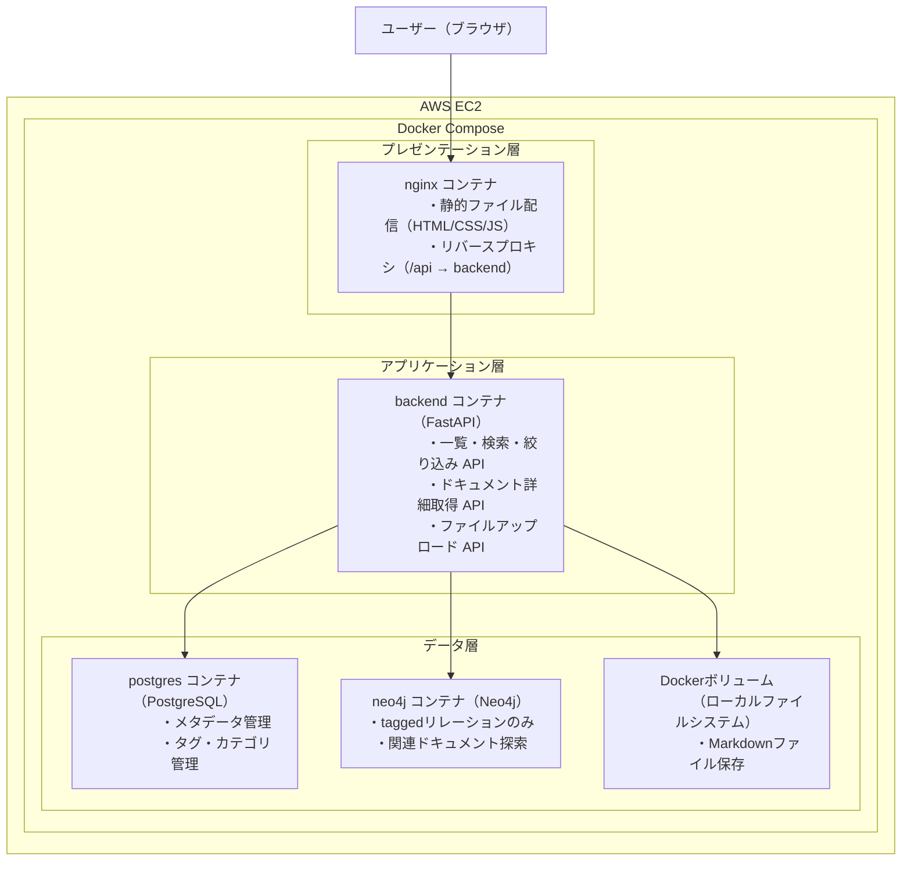
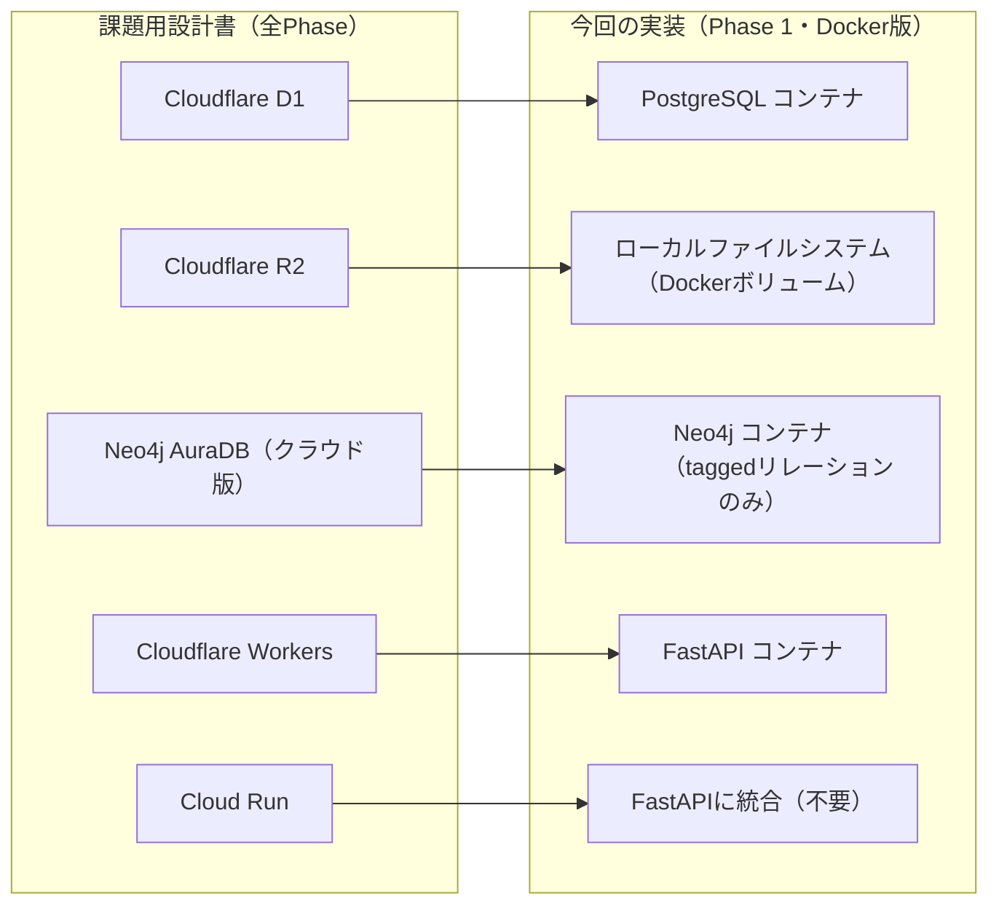

# 要件定義書

| 項目 | 内容 |
|------|------|
| システム名 | ナレッジ管理システム |
| サブシステム名 | Phase 1: 基本機能 |
| 作成者 | 鴫原 |
| 初版 | 2026/2/19 |
| 改訂 | 2026/2/24 |
| 版数 | 3 |
| 変更内容 | 2版フィードバック事項を反映 |

---

## 1. システム概要

### 1.1. システム名

ナレッジ管理システム

### 1.2. システムの目的

社内ドキュメント（Markdown (.md) ファイル）をインポートし、一覧・検索・閲覧・関連確認ができるナレッジ管理システムを構築する。
編集機能は持たず、インポート・閲覧・関係性探索に特化する。

### 1.3. ターゲットユーザー

- 想定：社内のエンジニア等
- 研修課題としては：研修担当者、研修受講者

### 1.4. データソース

| データ | データ形式 | 件数（想定） |
|--------|-----------|------------|
| 研修用・新規MDファイル | Markdown (.md) | 50〜100件程度 |

---

## 2. システム構成（WEB3層モデル）

### 2.1. インフラ構成

本システムは AWS EC2 上に Docker Compose を展開する構成とする。
WEB3層モデルの各層をコンテナとして分離し、Docker Compose で統合管理する。

```
インフラ：AWS EC2
構成管理：Docker Compose

コンテナ構成：
- nginx    : プレゼンテーション層（静的ファイル配信・リバースプロキシ）
- backend  : アプリケーション層（FastAPI）
- postgres : データ層（メタデータ管理）
- neo4j    : データ層（taggedリレーションのみ・Phase 1最小限）

ファイル保存：
- Dockerボリューム（/data/documents/）にMarkdownファイルを保存
```

### 2.2. 設計原則

- 編集機能を持たない：ファイルの更新はアップロードで再登録する
- Markdownへの統一：インポート対象はMarkdownのみ（Phase 1）
- 3ストアの役割分離：PostgreSQL（メタデータ）、ローカルファイルシステム（本文）、Neo4j（関係性）を明確に分ける

### 2.3. WEB3層モデルの概要

| 層 | 役割 | 使用技術 |
|----|------|---------|
| プレゼンテーション層 | ユーザーインターフェース・ブラウザからのアクセスを受け付ける | HTML / CSS / JavaScript、Nginx（リバースプロキシ） |
| アプリケーション層 | ビジネスロジック・APIの処理・データの加工 | FastAPI（Python） |
| データ層 | データ・ファイル・メタデータ管理 | PostgreSQL（メタデータ）、ローカルファイルシステム（Markdownファイル）、Neo4j（グラフDB） |

### 2.4. 技術スタック・選定理由

| コンポーネント | 技術 | 選定理由 |
|--------------|------|---------|
| インフラ | AWS EC2 | 研修環境として指定。Docker Compose をそのままデプロイ可能なため |
| コンテナ管理 | Docker / Docker Compose | WEB3層モデルの各層（nginx・FastAPI・PostgreSQL・Neo4j）をコンテナとして分離し、一括管理できるため |
| リバースプロキシ | Nginx | 静的ファイル配信とAPIルーティングを1つのコンテナで担えるため |
| バックエンドAPI | FastAPI（Python） | 軽量なWebフレームワークでREST API構築に適しているため |
| メタデータDB | PostgreSQL | 一覧・検索・ページネーションなどのCRUD操作に適しているため |
| 本文ストレージ | ローカルファイルシステム（Dockerボリューム） | R2の代替。Dockerボリュームで永続化できるため |
| グラフDB | Neo4j（Dockerコンテナ版） | AuraDB（クラウド版）の代替。Dockerコンテナ版で導入可能なため |

### 2.5. 課題用設計書（全Phase）との対応

課題用設計書（全Phase）はCloudflare構成で記載されているが、研修環境に合わせてDocker版に置き換えた構成を採用する。

| 課題用設計書（全Phase） | 本研修の実装（Phase 1・Docker版） |
|------------------------|----------------------------------|
| Cloudflare Workers | FastAPI（Python）コンテナ |
| Cloudflare D1（SQLite系RDB） | PostgreSQL コンテナ |
| Cloudflare R2（オブジェクトストレージ） | ローカルファイルシステム（Dockerボリューム） |
| Neo4j AuraDB（クラウド版） | Neo4j コンテナ（Docker版） |
| Cloud Run（インポートパイプライン） | FastAPI に統合（不要） |
| LangGraph / Claude API | 対象外 |
| Google Drive連携 | 対象外 |

### 2.6. 概要図



### 2.7. 課題用設計書との対応図



### 2.8. データストアの役割分離

| 操作 | 担当 | 理由 |
|------|------|------|
| ドキュメント一覧・ページネーション | PostgreSQL | 一覧表示・絞り込みが得意なRDBのため |
| テキスト検索・フィルタ | PostgreSQL | キーワード・カテゴリ・タグでの検索に適しているため |
| ドキュメント本文の表示 | ローカルファイルシステム | Markdownファイルを直接返すだけでよいため |
| 関連ドキュメントの探索 | Neo4j | 同タグのドキュメントをたどるのに適しているため |

---

## 3. 機能要件（Phase 1・MVP）

### 3.1. スコープ定義

| No. | 機能 | 概要 | 優先度 |
|-----|------|------|--------|
| 1 | ファイルアップロード | Markdownファイルをシステムに登録する | 必須 |
| 2 | 一覧表示 | ドキュメントの一覧をページネーション付きで表示する | 必須 |
| 3 | 検索 | タイトル・タグ・カテゴリで絞り込み検索する | 必須 |
| 4 | 閲覧 | Markdownを整形してドキュメントの本文を表示する | 必須 |
| 5 | 関連確認 | 同タグのドキュメントを関連ドキュメントとして表示する | 必須 |
| 6 | ブックマーク | ドキュメントをお気に入り登録する | 必須（簡易実装） |
| 7 | 閲覧履歴 | 最近閲覧したドキュメントを表示する | 必須（簡易実装） |

### 3.2. 機能詳細

#### 3.2.1 ファイルアップロード

- Markdownファイル（.md）をフォームからアップロードできる
- アップロード時にタイトル・タグ・カテゴリを手動入力できる
- ファイル名を初期タイトルとして自動セットする
- アップロードした本文をDockerボリューム（ローカルファイルシステム）に保存する
- メタデータ（タイトル・タグ・カテゴリ・投稿日時）をPostgreSQLに登録する
- Neo4jにDocumentノードとTagノードのtaggedリレーションを登録する

#### 3.2.2 一覧表示

- 登録されたドキュメントの一覧を表示する
- 1ページあたり20件表示し、ページネーションで切り替えられる
- 更新日時の降順で並べる
- タイトル・カテゴリ・タグ・更新日時を一覧に表示する

#### 3.2.3 検索

- タイトルのキーワード検索ができる
- カテゴリで絞り込みができる
- タグで絞り込みができる
- 複数条件を組み合わせて検索できる

#### 3.2.4 閲覧

- Markdownをレンダリングして表示する（見出し・コード・テーブルなど）
- タイトル・カテゴリ・タグ・更新日時をメタ情報として表示する

#### 3.2.5 関連確認

- 同じタグを持つドキュメントを関連ドキュメントとして最大5件表示する
- Neo4jのtaggedリレーションを使って取得する

#### 3.2.6 ブックマーク

- ドキュメントをお気に入り登録する（シングルユーザーのため簡易実装）

#### 3.2.7 閲覧履歴

- 最近閲覧したドキュメントを表示する（シングルユーザーのため簡易実装）

### 3.3. 対象外機能

| 機能 | 理由 |
|------|------|
| Google Drive連携 | Phase 3以降 |
| Claude API / LangGraph | Phase 2以降 |
| グラフ探索ビュー・概念検索 | Phase 2以降 |
| DOCX / PDF インポート | Phase 3以降 |
| アクセス制御（認証） | Phase 4以降 |

---

## 4. 画面一覧

| No. | 機能 | 概要 | URL（予定） |
|-----|------|------|------------|
| 1 | ドキュメント一覧画面 | 登録済みドキュメントの一覧・検索 | `/`（ルート） |
| 2 | ドキュメント詳細画面 | 本文表示（Markdownレンダリング） | `/documents/{id}` |
| 3 | ドキュメント登録画面 | ファイルアップロード（メタ情報入力） | `/upload` |
| 4 | 検索結果画面 | キーワード・タグ・カテゴリでの絞り込み結果 | `/search` |

---

## 5. 非機能要件

| 項目 | 内容 |
|------|------|
| 動作環境 | Docker / Docker Composeが動作する環境 |
| ブラウザ | Firefox、Google Chrome（最新版） |
| アクセス方法 | http://パブリックIPアドレス でアクセスできること |
| データ量 | 50〜100件のMarkdownファイル |
| レスポンス | 一覧取得：3秒以内 / 詳細表示：5秒以内（目安） |
| ソース管理 | GitHubにて公開（READMEあり） |
| 認証 | 不要（研修環境のためシングルユーザー想定） |
| システムテスト | シナリオベースの簡易テスト |

---

## 6. 開発スケジュール

| Week | 期間 | 作業内容 | 成果物 |
|------|------|---------|--------|
| Week 1 | 2/17〜2/20 | 要件定義 | 要件定義書 |
| Week 2 | 2/24〜2/27 | 基本設計・詳細設計 | 基本設計書・詳細設計書 |
| Week 3 | 3/2〜3/5 | 構築（インフラ） | docker-compose・DB構築 |
| Week 4 | 3/9〜3/13 | 構築（アプリ）・テスト | 最終成果物（システム） |

---
