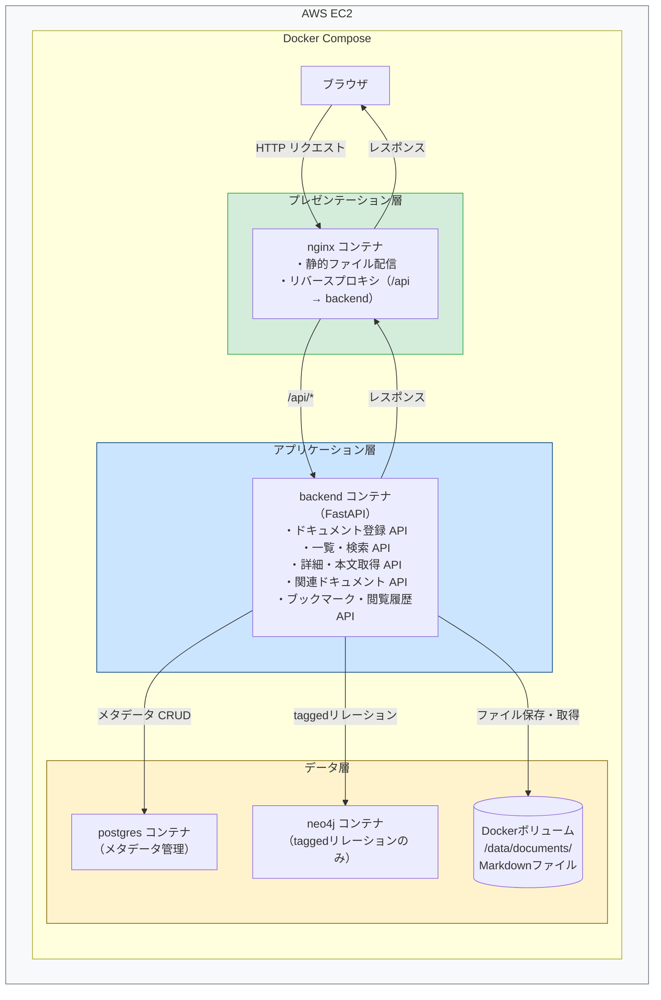
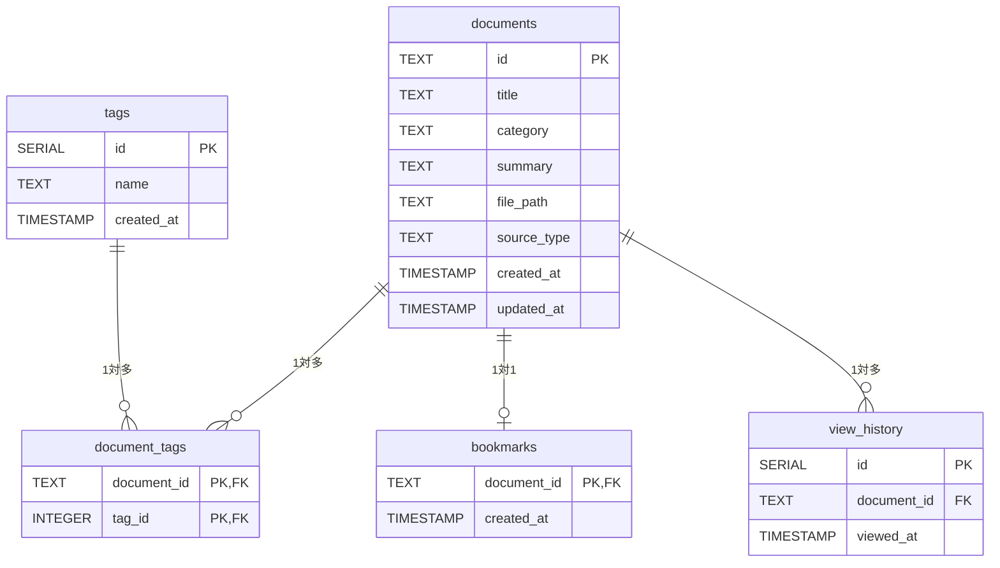
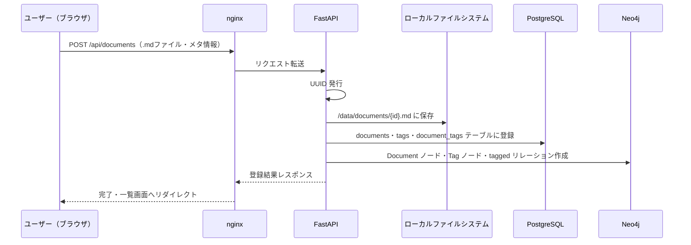
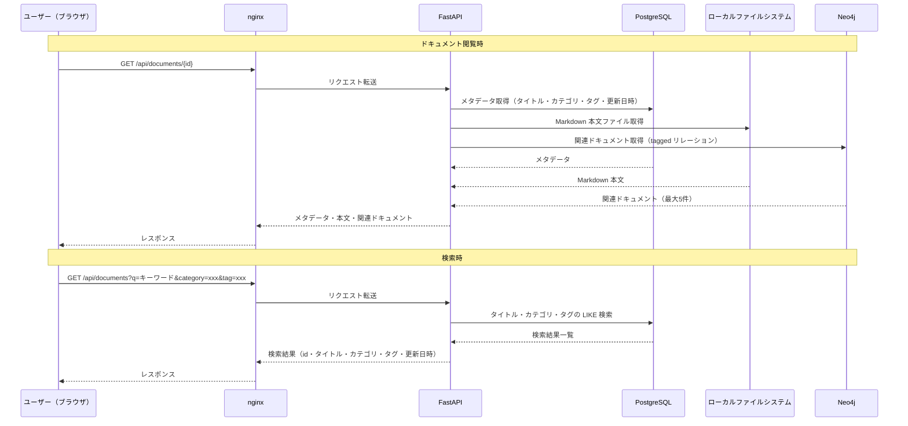

# 詳細設計書

| 項目 | 内容 |
|------|------|
| システム名 | ナレッジ管理システム |
| サブシステム名 | Phase 1: 基本機能 |
| 作成者 | 鴫原 |
| 初版 | 2026/2/27 |
| 改訂 | 2026/2/28 |
| 版数 | 2 |
| 変更内容 | 初版2フィードバック事項を反映（コンポーネントやシーケンス図など追加） |

---

## 0. システム構成図（Phase 1）

### 0.1. コンポーネント図



---

## 1. データベース詳細設計（PostgreSQL）

### 1.1. テーブル一覧

| No. | テーブル名 | 概要 |
|-----|-----------|------|
| 1 | documents | ドキュメントのメタデータ（タイトル・カテゴリ・要約・ファイルパス等） |
| 2 | tags | タグのマスタ |
| 3 | document_tags | ドキュメントとタグの中間テーブル（多対多） |
| 4 | bookmarks | ブックマーク（簡易実装） |
| 5 | view_history | 閲覧履歴（簡易実装） |

### 1.2. テーブル定義

#### 1.2.1. documents テーブル

| カラム名 | 型 | 制約 | 説明 |
|---------|-----|------|------|
| id | TEXT | PRIMARY KEY | ドキュメントID |
| title | TEXT | NOT NULL | タイトル |
| category | TEXT | - | カテゴリ |
| summary | TEXT | - | 要約（手動入力・空可） |
| file_path | TEXT | NOT NULL | ファイルパス |
| source_type | TEXT | NOT NULL DEFAULT 'md' | ソース種別（Phase 1は md 固定） |
| created_at | TIMESTAMP | NOT NULL DEFAULT NOW() | 登録日時 |
| updated_at | TIMESTAMP | NOT NULL DEFAULT NOW() | 更新日時 |

#### 1.2.2. tags テーブル

| カラム名 | 型 | 制約 | 説明 |
|---------|-----|------|------|
| id | SERIAL | PRIMARY KEY | タグID |
| name | TEXT | NOT NULL UNIQUE | タグ名 |
| created_at | TIMESTAMP | NOT NULL DEFAULT NOW() | 作成日時 |

#### 1.2.3. document_tags テーブル（中間テーブル）

| カラム名 | 型 | 制約 | 説明 |
|---------|-----|------|------|
| document_id | TEXT | FK → documents.id | ドキュメントID |
| tag_id | INTEGER | FK → tags.id | タグID |
| - | - | PRIMARY KEY (document_id, tag_id) | 複合主キー |

#### 1.2.4. bookmarks テーブル（簡易実装）

| カラム名 | 型 | 制約 | 説明 |
|---------|-----|------|------|
| document_id | TEXT | PRIMARY KEY, FK → documents.id | ドキュメントID |
| created_at | TIMESTAMP | NOT NULL DEFAULT NOW() | ブックマーク登録日時 |

> シングルユーザー想定のため、ユーザーIDカラムは持たない。

#### 1.2.5. view_history テーブル（簡易実装）

| カラム名 | 型 | 制約 | 説明 |
|---------|-----|------|------|
| id | SERIAL | PRIMARY KEY | 履歴ID |
| document_id | TEXT | NOT NULL, FK → documents.id | ドキュメントID |
| viewed_at | TIMESTAMP | NOT NULL DEFAULT NOW() | 閲覧日時 |

> シングルユーザー想定のため、ユーザーIDカラムは持たない。最新20件を表示する。

### 1.3. ER図



---

## 2. グラフDB詳細設計（Neo4j）：Phase 1

Phase 1では、Neo4j（Dockerコンテナ版）はタグによる関連ドキュメント取得のみに使用する。

### 2.1. Phase 1で使用するノード・リレーション

| 種別 | 名前 | 対象有無 | 説明 |
|------|------|---------|------|
| ノード | Document | 使用対象 | インポートされたドキュメント（id, title, category） |
| ノード | Tag | 使用対象 | タグ（name） |
| ノード | Concept | 対象外 | 技術概念（Phase 2以降） |
| リレーション | tagged | 使用対象 | Document → Tag（タグ付け） |
| リレーション | related_to | 対象外 | Document 間の関連（Phase 2以降） |
| リレーション | discusses | 対象外 | Document → Concept（Phase 2以降） |

### 2.2. 使用するCypherクエリ（Phase 1）

**ドキュメント登録時：**

```cypher
MERGE (d:Document {id: $id}) SET d.title = $title, d.category = $category
MERGE (t:Tag {name: $tag_name})
MERGE (d)-[:tagged]->(t)
```

**関連ドキュメント取得（同じタグを持つドキュメント）：**

```cypher
MATCH (d:Document {id: $id})-[:tagged]->(t:Tag)<-[:tagged]-(rel:Document)
WHERE rel.id <> $id
RETURN rel, count(t) AS common_tags
ORDER BY common_tags DESC
LIMIT 5
```

---

## 3. API一覧

### 3.1. API一覧（Phase 1のみ）

| No. | メソッド | エンドポイント | 概要 |
|-----|---------|--------------|------|
| 1 | GET | /api/documents | ドキュメント一覧取得（ページネーション・検索対応） |
| 2 | POST | /api/documents | ドキュメント新規登録（MDファイルアップロード） |
| 3 | GET | /api/documents/{id} | ドキュメント詳細取得（メタデータ） |
| 4 | GET | /api/documents/{id}/content | Markdown本文取得 |
| 5 | GET | /api/documents/{id}/related | 関連ドキュメント取得（同タグ） |
| 6 | GET | /api/bookmarks | ブックマーク一覧取得（簡易実装） |
| 7 | POST | /api/bookmarks | ブックマーク登録（簡易実装） |
| 8 | GET | /api/history | 閲覧履歴取得（簡易実装） |
| 9 | GET | /health | ヘルスチェック |

### 3.2. 主要APIの入出力仕様

#### 3.2.1. ドキュメント一覧取得

| 項目 | 内容 |
|------|------|
| Method / URL | GET /api/documents |
| クエリパラメータ | q（キーワード）, category, tag, page（デフォルト 1）, limit（デフォルト 20） |
| 検索方式 | タイトル・カテゴリ・タグの LIKE 検索（PostgreSQL） |
| レスポンス | `{ total, page, limit, items: [ { id, title, category, tags, updated_at } ] }` |

#### 3.2.2. ドキュメント登録

| 項目 | 内容 |
|------|------|
| Method / URL | POST /api/documents |
| リクエスト | multipart/form-data（file: .md ファイル, title, category, tags, summary） |
| 処理内容 | ① ローカルファイルシステムに保存 → ② PostgreSQL にメタデータ登録 → ③ Neo4j（Dockerコンテナ版）に Document ノード・tagged リレーション作成 |
| レスポンス | `{ id, title, category, tags, created_at }` |

#### 3.2.3. 関連ドキュメント取得

| 項目 | 内容 |
|------|------|
| Method / URL | GET /api/documents/{id}/related |
| 処理内容 | Neo4j（Dockerコンテナ版）で同じ Tag ノードを持つ Document を取得（tagged リレーションのみ使用） |
| レスポンス | `[ { id, title, category, tags, common_tag_count } ]`（最大5件） |
| 備考 | グラフ探索・概念検索は Phase 1 対象外 |

---

## 4. インポートフロー詳細（Phase 1）

| ステップ | 担当 | 処理内容 |
|---------|------|---------|
| 1 | Frontend | ユーザーが .md ファイル・タイトル・タグ・カテゴリを入力して送信 |
| 2 | Frontend | POST /api/documents に multipart/form-data で送信 |
| 3 | FastAPI | UUID を発行する |
| 4 | FastAPI + ローカルファイルシステム | Markdown ファイルを /data/documents/{id}.md に保存 |
| 5 | FastAPI + PostgreSQL | documents・tags・document_tags テーブルに保存 |
| 6 | FastAPI + Neo4j（Dockerコンテナ版） | Document ノード・Tag ノードと tagged リレーションを作成 |
| 7 | FastAPI → Frontend | 登録結果をフロントエンドに返却・一覧画面にリダイレクト |

### 4.2. インポートフロー シーケンス図



---

## 5. データフロー（画面別）

### 5.1. ドキュメント閲覧時

| 順序 | 担当 | 処理内容 |
|-----|------|---------|
| 1 | ブラウザ | GET /documents/{id} をリクエスト |
| 2 | nginx | リクエストを FastAPI に転送 |
| 3 | FastAPI + PostgreSQL | メタデータ（タイトル・カテゴリ・タグ・更新日時）を取得 |
| 4 | FastAPI + ローカルファイルシステム | Markdown 本文ファイルを取得 |
| 5 | FastAPI + Neo4j（Dockerコンテナ版） | 関連ドキュメントを取得（tagged リレーション） |
| 6 | FastAPI → ブラウザ | メタデータ・本文・関連ドキュメントをレスポンス |

### 5.2. 検索時

| 順序 | 担当 | 処理内容 |
|-----|------|---------|
| 1 | ブラウザ | GET /search?q=キーワード&category=xxx&tag=xxx をリクエスト |
| 2 | nginx | リクエストを FastAPI に転送 |
| 3 | FastAPI + PostgreSQL | タイトル・カテゴリ・タグの LIKE 検索を実行 |
| 4 | FastAPI → ブラウザ | 検索結果一覧（id・タイトル・カテゴリ・タグ・更新日時）をレスポンス |

### 5.3. シーケンス図



---

## 6. ディレクトリ構成

### 6.1. ディレクトリ構成一覧

| パス | 説明 |
|-----|------|
| /（ルート） | docker-compose.yml、README.md |
| /backend/ | FastAPI アプリケーション |
| /backend/main.py | API エントリーポイント |
| /backend/routers/ | API ルーター（documents, bookmarks, history） |
| /backend/db/ | PostgreSQL・Neo4j（Dockerコンテナ版）接続設定 |
| /backend/schemas/ | リクエスト・レスポンス Pydantic モデル |
| /backend/Dockerfile | バックエンドの Dockerfile |
| /data/documents/ | Markdown ファイルの保存先（Dockerボリューム） |
| /db/init/ | PostgreSQL 初期化 SQL スクリプト |
| /frontend/ | HTML、CSS、JavaScript |
| /frontend/index.html | 一覧・検索画面 |
| /frontend/detail.html | 詳細画面 |
| /frontend/upload.html | 登録画面 |
| /nginx/nginx.conf | リバースプロキシ設定 |

### 6.2. ディレクトリツリー

- / (ルート)
    - docker-compose.yml
    - README.md
    - backend/
        - main.py
        - routers/
        - db/
        - schemas/
        - Dockerfile
    - data/
        - documents/
    - db/
        - init/
    - frontend/
        - index.html
        - detail.html
        - upload.html
    - nginx/
        - nginx.conf

---
